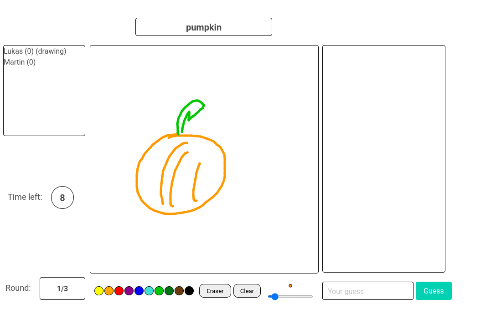

# drawing-game
A simple multi-player drawing game, similar to skribbl.io.
This game was developed for the practical part of the *Web Technology* course
at Graz University of Technology and is in no way feature-complete or pretty.

## How to run:

Ensure that nodejs and npm are installed.
Then, open a terminal, navigate into the "backend" directory and execute `npm install` and `npm run dev-server`
The application is then available at localhost:3000.

## License 
MIT